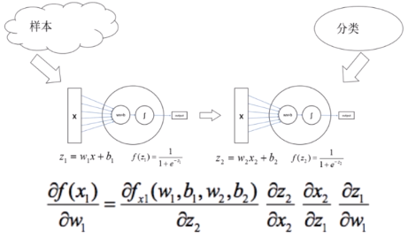
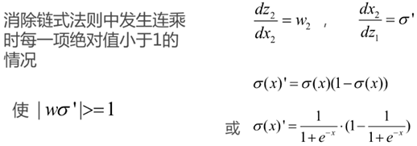
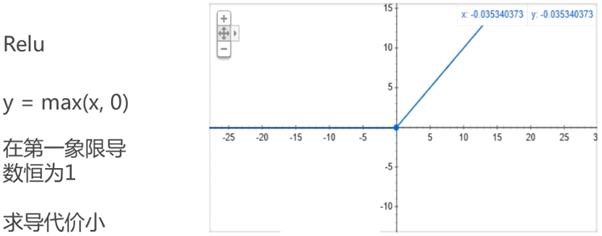
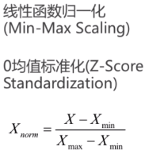
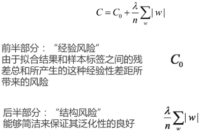

### 提高神经网络的学习效率

#### 并行计算
CUDA

#### 梯度消失问题

[神经网络训练中的梯度消失与梯度爆炸 - PENG的文章 - 知乎](https://zhuanlan.zhihu.com/p/25631496)

[深度神经网络的梯度不稳定问题--梯度消失与梯度爆炸](https://ziyubiti.github.io/2016/11/06/gradvanish/)

##### 改进思路

方法1：初始化一个合适的w

方法2：Relu

#### 归一化

批归一化（Batch Normalization）

#### 参数初始化
怎样初始化权重？

通常我们会使用：

均值为：0

标准差为：1/sqrt(n_in)

n_in：当前层神经元个数

#### 正则化

##### 泛化能力
泛化能力好：验证集和测试集

对于观察到的各种认识对象来说，描述共性的东西越抽象，越简洁，其泛化性也就越好；

相反，越是精确描述个体的东西，通常“个性化”的特点就非常明显，越具体，越复杂，泛化性也就越差

##### L1正则化

